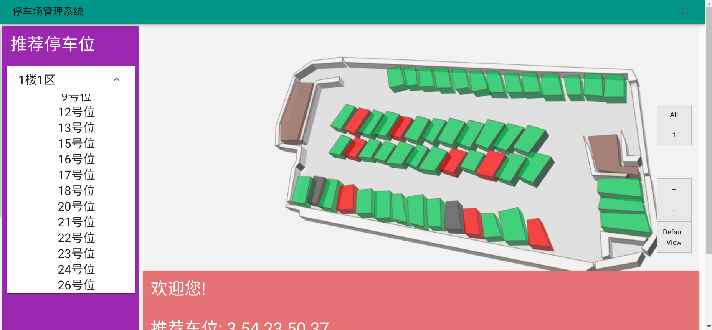
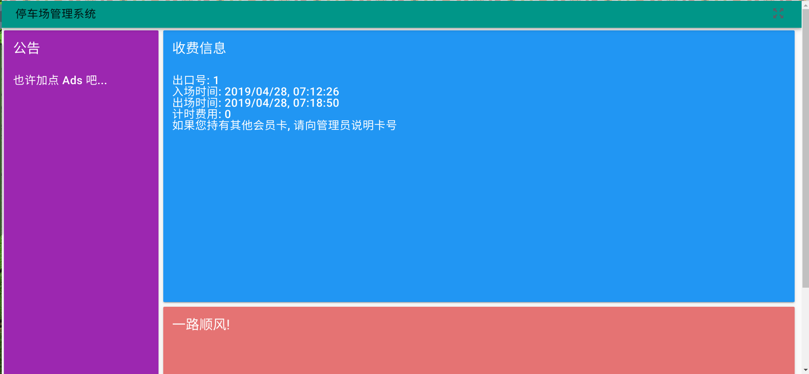
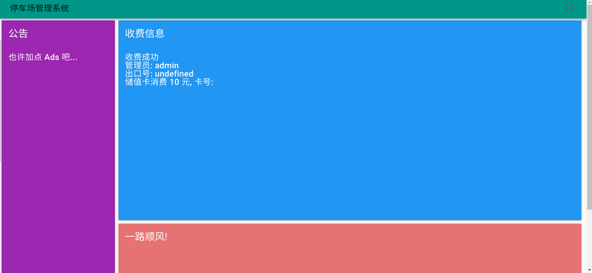
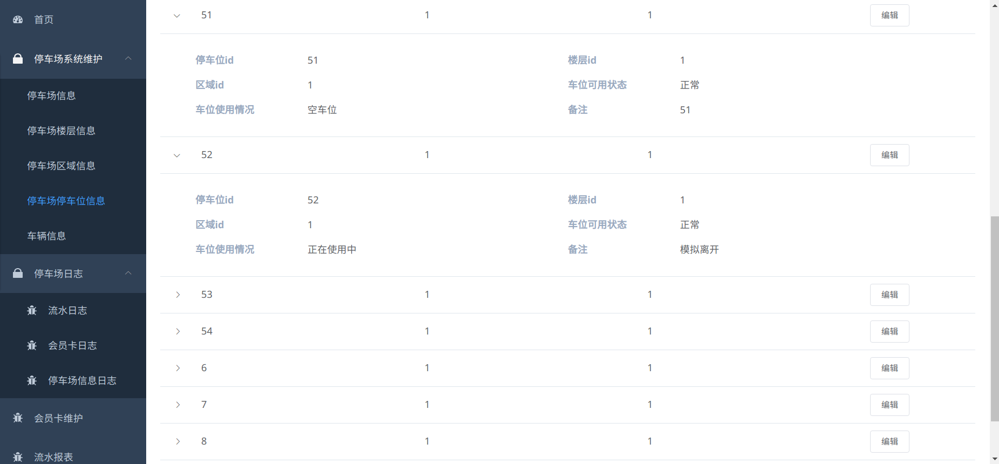
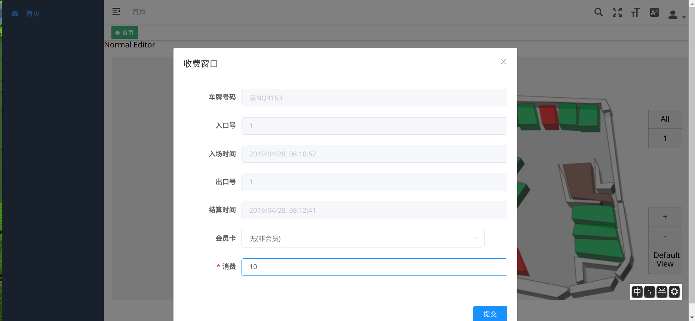
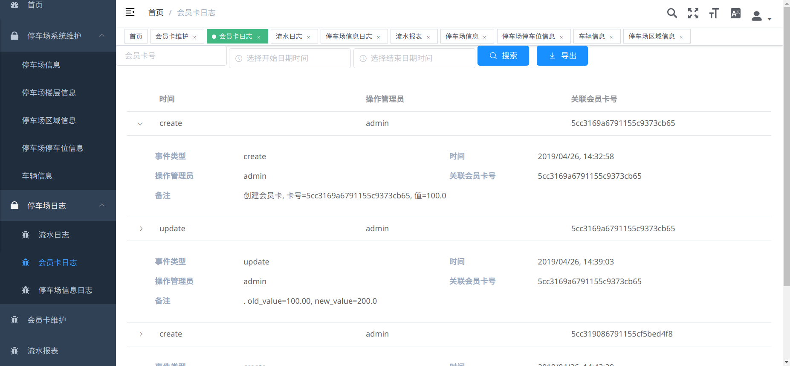
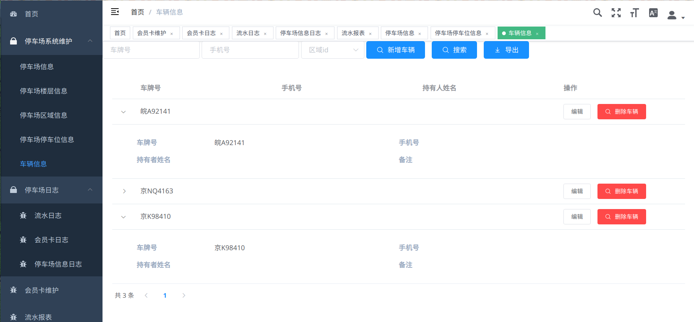
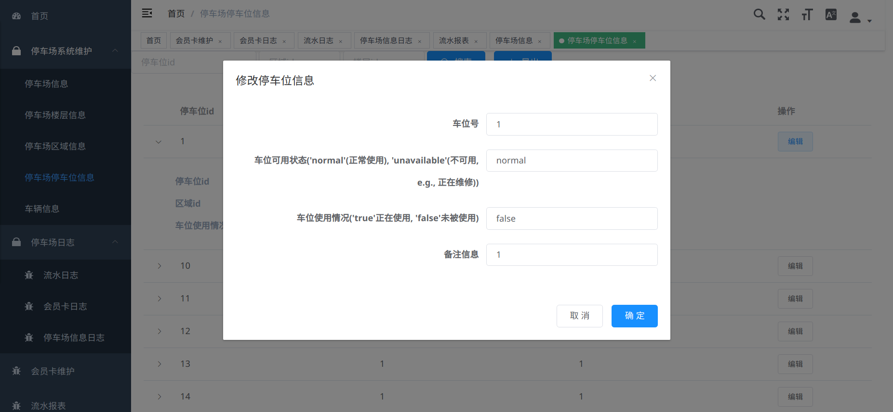
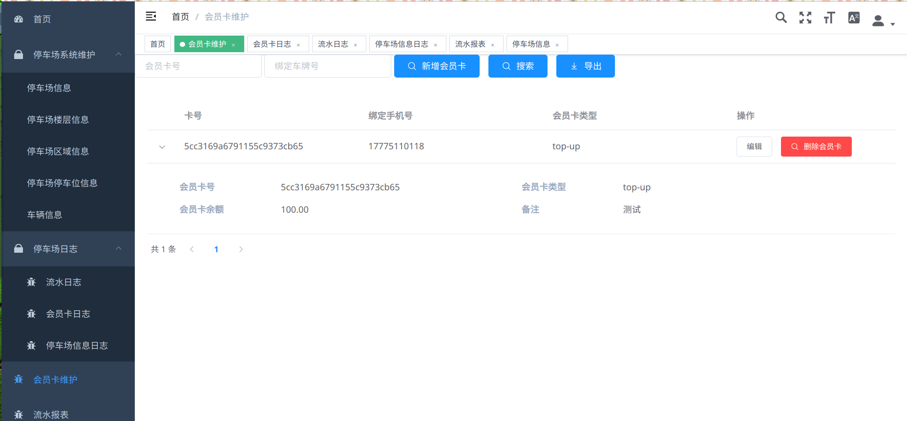

ParkingLot_full_stack

---

# 1. 简介

运行:

```bash
$ docker-compose up
```

等待自动创建容器, 下载安装依赖, 编译完成之后在浏览器浏览 `localhost:8080`

> 依赖 `docker-compose` 和 `Docker`

> 可以使用 `docker-compose up --build` 强制重新构建容器

> 可以使用 `docker-compose up -d` 后台运行容器

停车场 3D 建模 json 文件放置在 `./parking_lot/models/` 中  

要更改前端展示的 3D 模型, 请更改 `./parking_lot/db_frontend/src/components/ParkingLotMap.vue` 中对应代码 

## 1.1 技术栈

* Docker
* hyperlpr 中国车牌识别

前端:

* Vue
* Vuex
* Vuetify
* Three.js
* ElementUI
* axios

后端:

* Django
* MongoDB
* mongoengine
* pipenv-to-requirements
* Django Channels
* Celery
* Redis

# 2. 前端

## 2.1 Client 端







## 2.2 Admin 端















# 3. 后端

项目是跑在 Docker 里面的, pipenv 实在不好用, 所以我确定
Docker 里面不用 pipenv 了, 直接用 requirements.txt, 不过
开发的时候依然用 pipenv

所以如果更新了 pip 包, 需要 `pipenv shell` 进入 python 虚拟环境
后再 `pipenv-to-requirements -f` 生成对应的 `requirements.txt`

## 3.1 OCR 车牌识别

## 3.2 数据库

# 4. 预览

# 5. 参考
